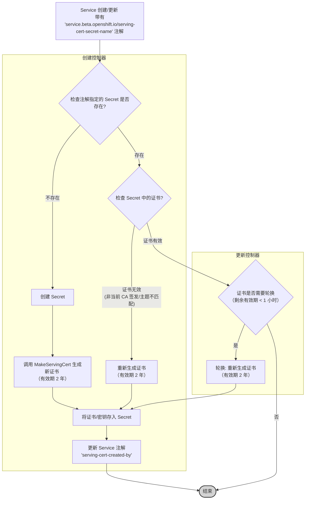

# Service CA Operator 证书有效期分析

本文档分析了 `service-ca-operator` 项目管理的服务证书的有效期。

## 核心发现

`service-ca-operator` 生成的服务证书 (Serving Certificate) 的有效期被硬编码设置为 **2 年**。

## 代码依据

证书的有效期在证书 **创建** 过程中被设定。相关的逻辑位于 `pkg/controller/servingcert/controller/secret_creating_controller.go` 文件中。

1.  **有效期定义**: 在 `MakeServingCert` 函数中，`certificateLifetime` 变量被明确设置为 `365 * 2` 天，即 2 年。

    ```go
    // 源代码文件: pkg/controller/servingcert/controller/secret_creating_controller.go
    func MakeServingCert(dnsSuffix string, ca *crypto.CA, intermediateCACert *x509.Certificate, service *corev1.Service) (*crypto.TLSCertificateConfig, error) {
        subjects := certSubjectsForService(service, dnsSuffix)
        // *** 此处定义了证书有效期（天数） ***
        certificateLifetime := 365 * 2 // 2 years
        servingCert, err := ca.MakeServerCert(
            subjects,
            // *** 此处将有效期传递给证书生成函数 ***
            certificateLifetime,
            cryptoextensions.ServiceServerCertificateExtensionV1(service.UID),
        )
        if err != nil {
            return nil, err
        }

        // ... (处理中间证书的逻辑) ...

        return servingCert, nil
    }
    ```

2.  **描述性注解确认**: 在同一个文件中的 `setSecretOwnerDescription` 函数，会为创建的 Secret 添加一个描述性的注解 (Annotation)，其中也明确提到了证书的 2 年有效期。

    ```go
    // 源代码文件: pkg/controller/servingcert/controller/secret_creating_controller.go
    func setSecretOwnerDescription(secret *corev1.Secret, service *corev1.Service) bool {
        // ... (其他注解设置) ...
        // 如果不存在，则为生成的 Secret 生成描述
        if len(secret.Annotations[apiannotations.OpenShiftDescription]) == 0 {
            // *** 注解内容明确说明了 2 年有效期 ***
            secret.Annotations[apiannotations.OpenShiftDescription] = fmt.Sprintf("Secret contains a pair signed serving certificate/key that is generated by Service CA operator for service/%s ... The certificate is valid for 2 years.", service.Name, /*...*/ secret.Name)
            changed = true
        }
        return changed
    }
    ```

## 证书生命周期流程图

以下流程图展示了 `service-ca-operator` 中服务证书的创建、检查和更新（轮换）的主要逻辑：



**流程说明:**

1.  **触发**: 当一个 Kubernetes Service 被创建或更新，并且包含了 `service.beta.openshift.io/serving-cert-secret-name` 注解时，`ServiceServingCertController` (创建控制器) 会被触发。
2.  **Secret 检查**: 控制器检查该注解中指定的 Secret 是否已经存在。
3.  **首次创建**: 如果 Secret 不存在，控制器会：
    *   创建一个新的 Secret。
    *   调用 `MakeServingCert` 函数生成一个新的 X.509 证书和私钥，有效期为 2 年。
    *   将证书和私钥存储在新创建的 Secret 中。
    *   更新 Service 的 `serving-cert-created-by` 注解，标记该证书是由当前 CA 生成的。
4.  **现有 Secret 检查**: 如果 Secret 已经存在，创建控制器会检查其中的证书：
    *   **签发者**: 证书是否由当前活动的 CA 签发？
    *   **主题**: 证书的 DNS 主题名是否与 Service 的预期名称匹配？
    *   如果证书无效（例如，由旧 CA 签发或主题不匹配），则会重新生成证书并更新 Secret。
5.  **轮换检查**: `ServiceServingCertUpdateController` (更新控制器) 会定期检查现有的、由 operator 管理的证书 Secret。
    *   它会检查证书的过期时间，该时间存储在 Secret 的 `service.beta.openshift.io/expiry-date` (或 alpha 版本的 `alpha.service-ca.openshift.io/expiry-date`) 注解中。
    *   **轮换触发条件**: 证书轮换的精确触发条件定义在 `pkg/controller/servingcert/controller/secret_updating_controller.go` 的 `requiresRegeneration` 函数中。该函数检查当前时间加上一个预设的 `minTimeLeftForCert` (最小剩余时间) 是否晚于证书的过期时间。
    *   `minTimeLeftForCert` 在控制器初始化时被硬编码设置为 **1 小时**。
    *   因此，当证书的剩余有效期 **小于 1 小时** 时，`requiresRegeneration` 函数返回 `true`，触发证书轮换。

    ```go
    // 源代码文件: pkg/controller/servingcert/controller/secret_updating_controller.go

    // requiresRegeneration 检查证书是否接近过期
    func (sc *serviceServingCertUpdateController) requiresRegeneration(service *v1.Service, secret *v1.Secret, minTimeLeft time.Duration) bool {
        // ... (省略 owner reference 检查) ...

        // 获取证书的过期时间注解
        expiryString, ok := secret.Annotations[api.ServingCertExpiryAnnotation]
        if !ok {
            expiryString, ok = secret.Annotations[api.AlphaServingCertExpiryAnnotation]
            if !ok {
                // 如果没有过期时间注解，则需要重新生成
                return true
            }
        }
        expiry, err := time.Parse(time.RFC3339, expiryString)
        if err != nil {
            // 如果无法解析过期时间，则需要重新生成
            return true
        }

        // *** 关键判断逻辑 ***
        // 如果 (当前时间 + 最小剩余时间) 晚于 证书过期时间，则需要重新生成
        if time.Now().Add(minTimeLeft).After(expiry) {
            return true
        }

        return false
    }

    // 在 NewServiceServingCertUpdateController 函数中，minTimeLeftForCert 被初始化
    func NewServiceServingCertUpdateController(
        // ... (参数列表) ...
    ) factory.Controller {
        sc := &serviceServingCertUpdateController{
            // ... (其他字段初始化) ...
            // TODO base the expiry time on a percentage of the time for the lifespan of the cert
            // *** 此处定义了触发重新生成的最小剩余时间阈值 ***
            minTimeLeftForCert: 1 * time.Hour,
        }
        // ...
    }
    ```
    *   **注意**: 代码中的 `TODO` 注释表明，将轮换阈值基于证书生命周期的百分比可能是未来的改进方向，但当前实现使用的是固定的 1 小时。

6.  **轮换执行**: 当 `requiresRegeneration` 返回 `true` 时，更新控制器会调用 `toRequiredSecret` 函数（与创建控制器使用的函数类似）来生成一个新的证书（有效期 2 年）和密钥，并用它们更新对应的 Secret。

## 结论

根据源代码分析，`service-ca-operator` 生成的服务证书有效期固定为 **2 年**。证书的自动轮换由 `ServiceServingCertUpdateController` 负责，其触发条件是证书的剩余有效期**小于 1 小时**。
