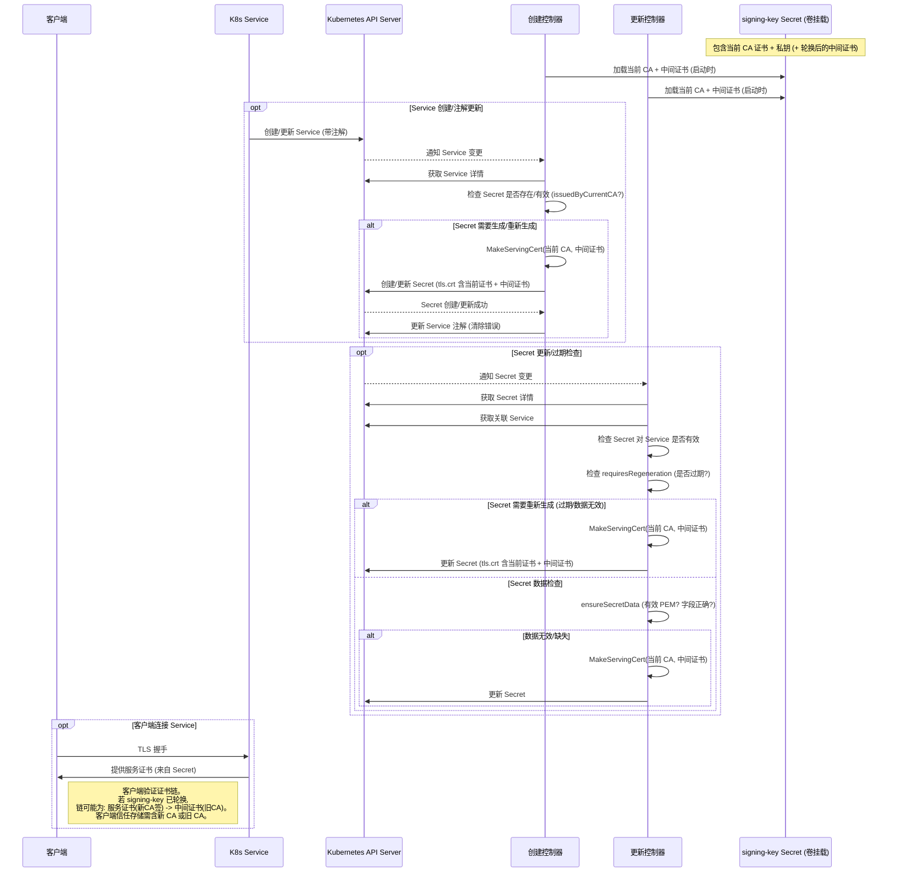

# Service CA Operator: signing-key 证书生命周期及影响分析

本文档分析了 `service-ca-operator` 中 `signing-key` Secret 的生命周期管理逻辑，以及它如何影响由其签发的服务证书 Secret。

## 1. `signing-key` Secret 生命周期与使用

*   **外部管理:** `signing-key` Secret（包含 service-ca 的主 CA 证书和私钥）本身不由 `service-ca-operator` 的核心控制器（如 `secret_creating_controller.go`, `secret_updating_controller.go`）直接管理。它的创建和轮换通常由集群的证书管理基础设施（如 cert-manager 或 OpenShift 内置机制）或其他 Operator 组件负责。
*   **加载与消费:**
    *   `service-ca-operator` 的 Pod 会将 `signing-key` Secret 挂载到容器内的 `/var/run/secrets/signing-key/` 路径。
    *   控制器启动时（如 `pkg/controller/servingcert/starter/starter.go` 中所示），会从该挂载路径读取 CA 证书 (`tls.crt`)、私钥 (`tls.key`) 以及可能的中间 CA 证书 (`intermediate-ca.crt`)。
    *   这些读取到的证书和密钥用于初始化一个 `crypto.CA` 对象和 `intermediateCACert` 变量，供后续的服务证书签发和更新控制器使用。

    ```go
    // 代码片段来源: pkg/controller/servingcert/starter/starter.go
    certFile := "/var/run/secrets/signing-key/tls.crt"
    keyFile := "/var/run/secrets/signing-key/tls.key"
    intermediateCertFile := "/var/run/secrets/signing-key/intermediate-ca.crt"

    ca, err := crypto.GetCA(certFile, keyFile, "") // 加载当前 CA
    // ...
    intermediateCACert, err := readIntermediateCACert(intermediateCertFile) // 如果存在，加载中间 CA
    // ... 将 ca 和 intermediateCACert 传递给控制器
    ```

## 2. 服务证书生成 (使用 `signing-key` CA)

*   **触发机制:** 当一个 Kubernetes Service 对象包含 `service.beta.openshift.io/serving-cert-secret-name: <secret-name>` (或 alpha 版本的注解) 时，`service-ca-operator` 会为其生成或更新对应的 TLS Secret。
*   **签名过程:** `secret_creating_controller.go` 中的 `MakeServingCert` 函数负责生成证书。它使用从 `signing-key` 加载的 `ca` 对象来签署新的服务证书。
*   **证书有效期:** 生成的服务证书默认有效期为 2 年。

    ```go
    // 代码片段来源: pkg/controller/servingcert/controller/secret_creating_controller.go
    func MakeServingCert(dnsSuffix string, ca *crypto.CA, intermediateCACert *x509.Certificate, service *corev1.Service) (*crypto.TLSCertificateConfig, error) {
        // ...
        certificateLifetime := 365 * 2 // 2 年有效期
        servingCert, err := ca.MakeServerCert( // 使用加载的 CA 对象进行签名
            subjects,
            certificateLifetime,
            cryptoextensions.ServiceServerCertificateExtensionV1(service.UID),
        )
        // ...
        // 如果存在中间证书 (旧 CA 证书)，则将其附加到证书链中
        if intermediateCACert != nil {
            servingCert.Certs = append(servingCert.Certs, intermediateCACert)
        }
        // ...
        return servingCert, nil
    }
    ```

## 3. `signing-key` 轮换的影响

*   **Operator 重载:** 当外部机制轮换（更新）`signing-key` Secret 时，`service-ca-operator` Pod 需要重新加载新的 CA 证书和密钥。这通常通过 Pod 重启或依赖 Kubernetes 的 Secret 卷更新机制来实现。重要的是，轮换后的 `signing-key` Secret 中的 `intermediate-ca.crt` 文件（如果存在）应包含*旧的* CA 证书。
*   **现有服务证书:** 之前由*旧* `signing-key` CA 签署的服务证书**不会立即失效**。它们在其自身的到期日期（通常是 2 年）之前或被控制器明确重新生成之前，将一直保持有效。
*   **服务证书重新生成触发器:** 服务证书 Secret 会在以下情况下被重新生成（即使用*新的* CA 重新签名）：
    *   **即将到期:** `secret_updating_controller.go` 检测到证书的剩余有效期小于预设阈值（`minTimeLeftForCert`，当前代码中为 1 小时）。
        ```go
        // 代码片段来源: pkg/controller/servingcert/controller/secret_updating_controller.go
        func (sc *serviceServingCertUpdateController) requiresRegeneration(...) bool {
            // ... 检查证书上的 expiry 注解 ...
            expiryString, ok := secret.Annotations[api.ServingCertExpiryAnnotation]
            // ...
            expiry, err := time.Parse(time.RFC3339, expiryString)
            // ...
            if time.Now().Add(minTimeLeft).After(expiry) { // 如果当前时间 + 最小剩余时间 > 过期时间
                return true // 需要重新生成
            }
            // ...
            return false
        }
        ```
    *   **签发者不匹配:** `secret_creating_controller.go` 在处理 Service 或 Secret 的变更事件时，会检查现有证书是否由*当前加载的* CA 签发（通过 `issuedByCurrentCA` 函数比较证书的 Authority Key ID 和 Subject Key ID）。如果签发者不匹配（意味着 `signing-key` CA 已经轮换），则会触发重新生成。
        ```go
        // 代码片段来源: pkg/controller/servingcert/controller/secret_creating_controller.go
        func (sc *serviceServingCertController) secretRequiresCertGeneration(...) bool {
            // ...
            if !sc.issuedByCurrentCA(cert) { // 检查是否由当前 CA 签发
                return true // 如果不是，需要重新生成
            }
            // ...
        }
        ```
    *   **数据无效或损坏:** `secret_updating_controller.go` 在检查 Secret 时发现 `tls.crt` 或 `tls.key` 字段缺失、数据无法解析为有效的 PEM 格式证书，或 Secret 包含非预期的额外数据字段时，会触发重新生成以修复 Secret。
*   **中间证书的角色:** 在 `signing-key` CA 轮换后重新生成服务证书时，`MakeServingCert` 函数会将 `intermediateCACert`（即*旧的* CA 证书）附加到新证书链的末尾，并一起存储在 Secret 的 `tls.crt` 字段中。这形成了一个证书链：`服务证书 (由新 CA 签发) -> 中间证书 (旧 CA 证书)`。这个机制至关重要，它允许那些*仅信任旧 CA*（尚未更新其信任存储）的客户端在 CA 轮换的过渡期内，仍然能够验证由新 CA 签发的新服务证书。

## 4. 结论

`signing-key` Secret 是 `service-ca-operator` 签发服务证书的信任根。它的轮换不会导致已签发的服务证书立即失效。Operator 通过检查证书有效期、签发者匹配性以及数据完整性来触发服务证书的重新生成。通过使用中间证书机制，确保了在 CA 轮换期间服务的连续性和客户端兼容性。其他由 `service-ca-operator` 管理的 Secret（即服务证书 Secret）的生命周期是依赖于 `signing-key` 的，但并非实时同步更新，而是在满足特定条件时进行更新和重新签发。

## 5. Mermaid 时序图

