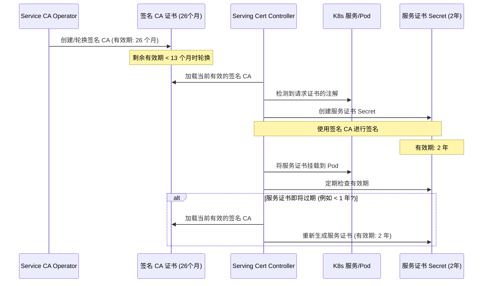

# Service CA Operator 证书有效期分析：26个月 vs 2年

在 `service-ca-operator` 的代码中，存在两个不同的证书有效期设置，分别是 26 个月和 2 年。这并非冲突，而是分别应用于不同类型的证书。

## 1. 签名 CA 证书 (Signing CA Certificate) - 26 个月

*   **管理文件:** `pkg/operator/rotate.go`
*   **作用:** 这是 Service CA Operator 用来**签发**其他服务证书的根 CA 证书。
*   **存储位置:** Kubernetes Secret `signing-key` (位于 `openshift-service-ca` 命名空间)。该 Secret 包含证书 (`tls.crt`) 和对应的**私钥** (`tls.key`)。
*   **有效期:** `SigningCertificateLifetimeInDays = 790` (约 26 个月)。
*   **轮换机制:** 轮换过程 (在 `rotate.go` 中) 读取当前的证书和**私钥** (`tls.key`)。它生成一个新的密钥对，并使用**旧的私钥**来签署一个中间证书，以确保证书链在轮换期间的连续性。
*   **代码片段:**
    ```go
    // pkg/operator/rotate.go
    const (
        // SigningCertificateLifetimeInDays is the lifetime of the CA certificate in days.
        // We keep this slightly longer than 2 years to ensure that the CA is valid
        // for the full lifetime of the certificates it issues. CAs are rotated when
        // their remaining lifetime is less than minimumTrustDuration (13 months).
        // Certificates are rotated when their remaining lifetime is less than 1 year.
        // This means that the CA should be valid for at least 1 year + 13 months = 25 months.
        // We choose 26 months (790 days) to be safe.
        SigningCertificateLifetimeInDays = 790 // 26 months
        // ...
        minimumTrustDuration = 395 * 24 * time.Hour // 13 months
    )

    func rotateSigningCA(...) (*signingCA, error) {
        // ...
        // 创建一个新的自签名 CA 配置，有效期为 26 个月
        newCAConfig, err := crypto.MakeSelfSignedCAConfigForSubject(currentCACert.Subject, SigningCertificateLifetimeInDays)
        // ...
    }
    ```
*   **设计原因:** 26 个月的有效期是为了确保签名 CA 在集群升级周期（通常为 12 个月）和自动轮换触发点（剩余有效期 < 13 个月时）之间保持有效。这可以防止在升级过程中服务重启时遇到 CA 过期的问题。

## 2. 服务证书 (Serving Certificates) - 2 年

*   **管理文件:** `pkg/controller/servingcert/controller/secret_creating_controller.go`
*   **作用:** 这些是由**签名 CA 签发**的、供 Kubernetes Service（挂载到 Pod 中）实际使用的证书。
*   **有效期:** `certificateLifetime := 365 * 2` (精确 2 年)。
*   **代码片段:**
    ```go
    // pkg/controller/servingcert/controller/secret_creating_controller.go
    func (c *ServiceServingCertController) createServiceServingCert(service *corev1.Service, ca *crypto.CA) (*corev1.Secret, error) {
        // ...
        // 设置服务证书的有效期为 2 年
        certificateLifetime := 365 * 2 // 2 years
        // 使用当前的 CA 来创建服务证书
        servingCert, err := ca.MakeServerCert(
            names.GetDefaultServingHostnameSet(service.Namespace, service.Name),
            certificateLifetime,
        )
        // ...
    }
    ```
*   **设计原因:** 为服务使用的证书设置了标准的 2 年生命周期。这些证书由 Controller 在其 2 年有效期到期前，使用当前有效的签名 CA 自动续期。

## 结论

两者没有冲突：

*   **签名 CA 证书:** 26 个月有效期 (由 `pkg/operator/rotate.go` 管理)。
*   **服务证书 (由 CA 签发):** 2 年有效期 (由 `pkg/controller/servingcert/controller/secret_creating_controller.go` 管理)。

## Mermaid 时序图


