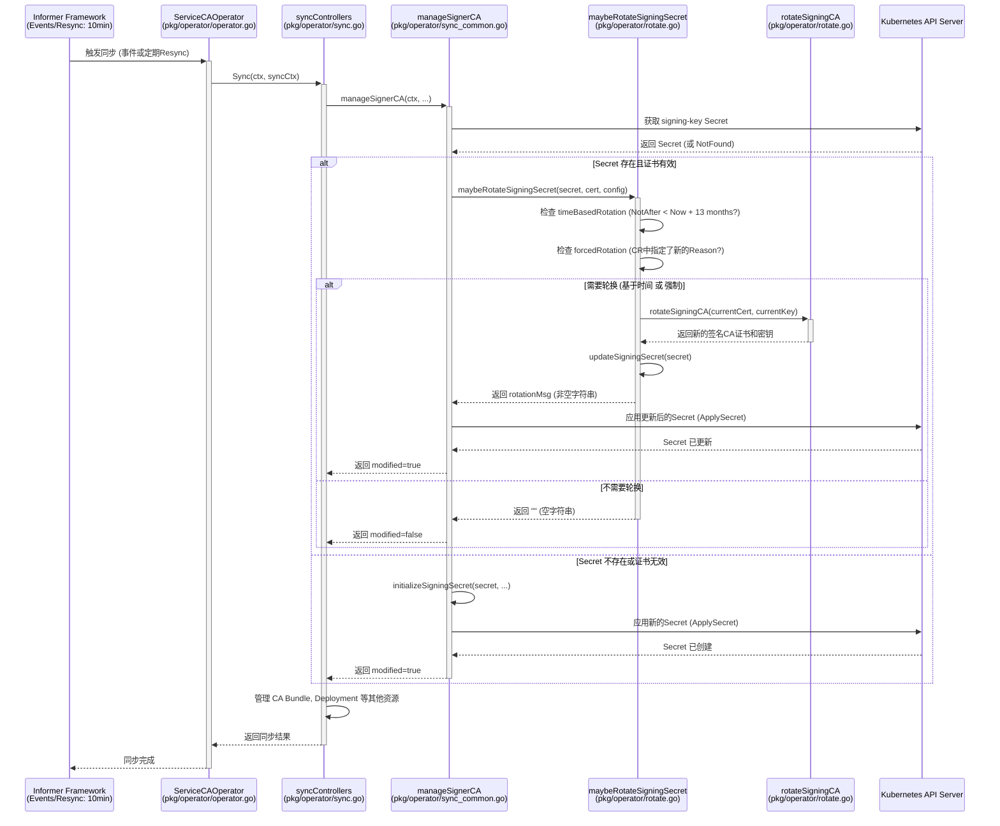

# Service CA Operator 证书轮换机制分析 (中文)

根据对 `pkg/operator/rotate.go` 源代码的分析，`service-ca-operator` 中**没有**一个专门用于监控证书过期的独立无限循环。

证书的轮换检查逻辑被集成在 Operator 的标准同步/Reconciliation 循环中。这个循环由 Kubernetes Informer 框架驱动，主要通过以下方式触发：

1.  **事件驱动**: 监听相关资源（如 `ServiceCA` 自定义资源、`signing-key` Secret 等）的变化事件。
2.  **定期 Resync**: Operator 配置了一个 10 分钟的 Resync 周期 (`DefaultResyncInterval`)，即使没有事件发生，也会定期触发同步。

在每次同步循环执行时，`syncControllers` 函数 (位于 `pkg/operator/sync.go`) 会调用 `manageSignerCA` (位于 `pkg/operator/sync_common.go`)，后者进而调用 `maybeRotateSigningSecret` 函数 (位于 `pkg/operator/rotate.go`) 来检查是否需要轮换签名 CA 证书。

## 轮换触发条件

轮换的触发条件如下：

*   **基于时间的轮换**: 当前 CA 证书的剩余有效期少于 `minimumTrustDuration`（硬编码为 13 个月）。
    ```go
    // pkg/operator/rotate.go
    minimumTrustDuration = 395 * 24 * time.Hour // 13 months
    // ...
    minimumExpiry := time.Now().Add(minimumTrustDuration)
    timeBasedRotation := currentCACert.NotAfter.Before(minimumExpiry)
    ```
    这意味着当证书有效期还剩 13 个月或更少时，就会触发基于时间的轮换。

*   **强制轮换**: 在 `ServiceCA` CR 的 `spec.unsupportedConfigOverrides.forceRotation.reason` 字段中指定了一个新的、不同于上次记录在 `signing-key` Secret 注解 (`serviceca.operator.openshift.io/forced-rotation-reason`) 中的原因。
    ```go
    // pkg/operator/rotate.go
    func forcedRotationRequired(secret *corev1.Secret, reason string) bool {
        if len(reason) == 0 {
            // 如果 CR 中没有指定 reason，则不强制轮换
            return false
        }
        // 获取上次记录在 Secret 中的轮换原因
        seenReason := secret.Annotations[api.ForcedRotationReasonAnnotationName]
        // 如果 CR 中的 reason 与 Secret 中的不同，则需要强制轮换
        return reason != seenReason
    }
    // ...
    // 从 ServiceCA CR 配置中获取强制轮换原因
    reason := serviceCAConfig.ForceRotation.Reason
    // 调用函数判断是否需要强制轮换
    forcedRotation := forcedRotationRequired(secret, reason)
    ```

只有当满足上述任一条件 (`forcedRotation || timeBasedRotation`) 时，`maybeRotateSigningSecret` 函数才会执行实际的证书轮换操作 (`rotateSigningCA`) 并更新 `signing-key` Secret。

## 时序图

以下时序图展示了证书轮换检查的流程：



## 结论

`service-ca-operator` 的证书轮换检查是其标准 Reconciliation/同步循环的一部分，依赖于 Kubernetes 的事件驱动和定期同步机制（默认为 10 分钟）。它**不是**通过一个独立的、持续运行的无限循环来监控证书有效期的。轮换主要由证书剩余有效期（少于 13 个月）或管理员通过 CR 强制触发。
